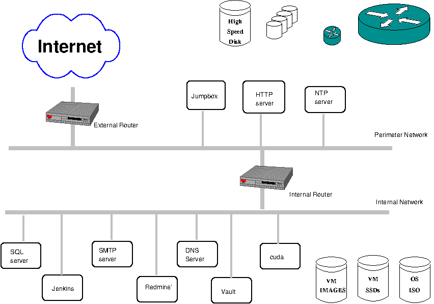
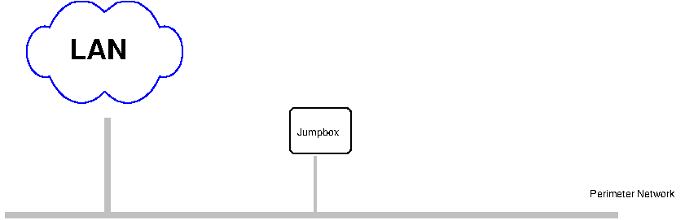

## Objective
The objective is a development environment on the cloud

<figure>
  
  <figcaption> The target architecture.</figcaption>
</figure>
# 

## The plan in general
The plan is to proceed as follows:
- Develop on the `cuda` machine with `libvirt`.
- Use Terraform with progressively complex scripts.
- Convert to a template.
- Deploy onto a free IaaS platform.
- Deploy onto GCloud.

## Development plan

### Deployment with `libvirt`
#### The development environment
- The `libvirt` host will be the `cuda` PC.
- The development will be done on the iMac.

#### Deployment 0
- Add the necessary services to the `cuda` machine
   - `libvirt`
- Create a separate network of CI/CD tools (The ideal would be to place it on
  the iMac, but that may not be efficient.)
   - Add a jumpbox to the network
   - Add a name server server to the network
   - Add a Jenkins server to the network
- Prepare a storage pool for the VM images
- Prepare a storage pool for the VM disks
- Prepare the repository
<figure>
  
  <figcaption> Work on dev; merge with staging; test on staging; merge with
  master and test again.</figcaption>
</figure>

#### Deployment 1
<figure>
  
  <figcaption> An intermediate architecture.</figcaption>
</figure>

- A single host
- The 'Perimeter Network'

#### Deployment 2
<figure>
  
  <figcaption> An intermediate architecture.</figcaption>
</figure>

- A single host 
- The "Perimeter Network"
- Improve the firewall with an 'external router'

#### Deployment 3
<figure>
  
  <figcaption> An intermediate architecture.</figcaption>
</figure>

- A single host 
- The "Perimeter Network"
- Improve the firewall with an 'external router'
- Add the "internal network"
- Add the 'internal router'

#### Deployment 4
- A single host 
- The "Perimeter Network"
- Improve the firewall with an 'external router'
- Add the "internal network"
- Add the 'internal router'
- Add servers
    - NTP server
    - DNS server
    - SMTP server
    - MySQL server
    - HTTP server
- Add the other HTTP servers
   - Jenkins
   - Proxmox
   - Redmine
   - Vault
- Add the CUDA host

### Deployment with `terraform` templates
   TBD

### Deployment onto GCloud
   TBD

## CI/CD
The development 

## Status

- 3 Dec 2025
