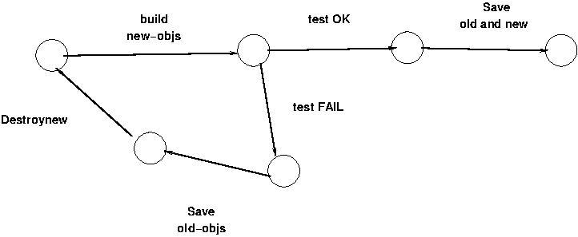

## Objective
The objective is to provide an local network of VMs which will support the
development.

## Development tools
The bulk of the deployment and configuration will use:
- Hashicorp Terraform
- Hashicorp Sentinel
- Ansible

## Target system
- The DHCP and DNS servers are provided by `libvirt` and `dnsmasq`.
- A jumpbox will be provided.
- A MySQL server will be provided.
- The following Turnkey appliances will be configured.
  - Redmine
  - Jenkins
- The following pools will be provided.
  - A pool of Turkey ISOs.
  - A pool to store the VM images
  - A pool of SSD volumes.

## Concerns/Issues
-  I plan to proceed iteratively---building->configuring->altering.  
-  Once I have a reliable collection of Terraform and Ansible scripts, I need
   a way to reconstruct the environment.  I suppose that backing up the disks
   and the databases will suffice.
-  How to handle sensitive data?
-  Why does `terraform` fail to `undefine` the VMs?

## Notes
- There are several different ways to assign a value to an input variable
  (defined in a `.tf` file:
   - Include -var options on the terraform plan or terraform apply command line.
   - Include -var-file options to select one or more `.tfvars` files to set values for many variables at once.
   - Create a `terraform.tfvars` file, or files named `.auto.tfvars`, which are treated the same as -var-file arguments but are loaded automatically.
   - For a child module, include an expression to assign to the variable inside the calling module block.

## TO DO
  - Add a real vault

## Development configurations

  The development is to proceed iteratively.  I plan to add more and more
  objects to the deployment until I reach the final state.
    <figure>
      
      <figcaption> The testing states</figcaption>
    </figure>

  1.  Build all storage pools and volumes

      1. OS-ISOs
          1.  Turnkey Core
          1.  Turnkey Jenkins
          1.  Turnkey Redmine
          1.  Turnkey Nginx
          1.  Proxmox Server
          1.  NTP server
      1. VM-SSDs
          1.  Vault
          1.  Proxmox
          1.  Jenkins
          1.  Redmine
          1.  Nginx
          1.  ntp-server
          1.  Jenkins SSD
      1. VM-images (QEMD)

  1.  Download all ISOs and Images

  1.  Build all sub-networks
      1. inner
      1. outer

  1.  Build all instances tied to the 'perimeter network'
      1. jumpbox
      1. nginx
      1. ntp

  1.  Build all instances tied to the 'internal network'
      1. vault
      1. proxmox
      1. redmine
      1. jenkins
      1. jenkins-workers
      1. cuda

## Status

- 9 Dec 2025
   - Reconstructing the directory to follow the Terraform best practices.

- 11 Dec 2025
   - I was able to `create` and `undefine` an instance.  
     Until I find a cleaner approach I must use the following sequence of
     commands.
     ```
        terraform apply -auto-approve  -var 'vm_condition_poweron=true'
        terraform apply -auto-approve  -var 'vm_condition_poweron=false'
        terraform apply -auto-approve  -var 'vm_condition_poweron=false' -destroy
     ```
     The first command deploys the resources.  The second command will result
     in the destruction of the VM.  The third command will destroy the
     other resources.

     The `terraform` application fails to undefine the VM, and I cannot
     figure out why.  The second step destroys the VM with the `virsh` CLI.

   - The following figure was lifted from the `libvirt` wiki.

<figure>
  
  <figcaption> The VM lifecycle graph</figcaption>
</figure>

   - For the next time:
      - Add 'jean' as a user.
      - Establish and check the DNS.

- 13 Dec 2025

   - ~~Add 'jean' as a user.~~
   - ~~Establish and check the DNS.~~

   - For the next time:
      - Start to improve the jumpbox
      - ~~Establish and check the DNS.~~

- 14 Dec 2025

   - Worked further on the creation of a root certificate.  The scripts are in build-certs

- 18 Dec 2025
   - Worked on the development configurations
   - Started to write a script to incrementally build the infrastructure.  The
     script is named `build-infrastructure.sh`.
   - I had to download the ISOs from Turnkey, because the provider could not
     build the volume from the specified URL.
   - The script builds and destroys the pools and a few of the volumes.
   - For the next time:
      - ~~Build the volumes required for the VMs.~~

- 19 Dec 2025
   - Built the volumes required for the VMs.
   - For the next time:
      1. ~~Add the networks.~~
      1. Boot a VM with the 'alpine' qcow2 image.
      1. Boot a VM with the Turnkey 'core' ISO.
      1. Start to use `Ansible` to build some of the VMs.

- 20 Dec 2025
   - Ran into a problem with the ISO images.  I am using the ISO as a backing
     store, but the ISO is used to boot the VM.  The boot scripts therefore try
     to write the ISO.  That is, the script is trying to alter the booting medium.

     I am going to change the configuration so that the initial construction
     of an ISO based VM mounts the CD-ROM with the ISO.  This should allow the
     boot to complete.  The hard drive will have no backing store.

     The IMG based VMs will boot as currently configured.

   - I have to rework the Terraform code.  This is the new plan:
      1. Use `virsh` to build the pools.
      1. Use the VM manager to build the `.qcow2` files derived from `Turnkey`.
         The result will be a collection of QCOW2 files which must be stored
         in the 'image' pool.

         The following images should be based on the `Terraform` appliances:
            1. The `vault` image---using the 'core' ISO.
            1. The `nginx` image.
            1. The `jenkins` image.
            1. The `redmine` image.
            1. The `my-sql` image.
      1. Use the VM manager to build the rest of the `.qcow2`.
            1. The `cuda` image.
            1. The `proxmox` image.
            1. The `ntp` image.
            1. The `dns` image.
            1. The `smtp` image.
      1. Remove the dynamic construction of the pools and volumes from the
      `Terraform` scripts.
   - Building `qcow2` images...
      1. The `vault` image---using the 'core' ISO.
      1. ~~The `nginx` image.~~
      1. ~~The `jenkins` image.~~
      1. ~~The `my-sql` image.~~
      1. The `redmine` image.

- 22 Dec 2025
   - Got `vault` and `jumpbox` to build.
   - Decided to rework it again.  This time I am thinking of building the
     jumpbox, nginx, vault, ansible, jenkins and proxmox images by hand.  The proxmox would
     host the jenkins workers.

     The jumpbox would be a simple alpine image.  The nginx, vault and jenkins images
     would be taken from Turnkey.  The jenkins workers would ultimately be
     containers hosted by proxmox, but at first they  would be full VMs.

     I could use `terraform import` to get a snapshot of the full infrastructure. I
     would need a diffent tool to get snapshots of the deployment.

     I would use the ansible image to configure the rest of the images.

   - How do test that the VMs were successfully deployed and configured?
      - The Terraform Vault tutorials give a good example for `vault`.
      - Use `ping`?
      - Use `curl` and the API?
      - Use `Ansible` to load a test?

- 23 Dec 2025
   - This is the new plan:
      - Use terraform to build the networks.
      - Build the jumpbox VM.
      - Build the NGINX VM.
      - Build vault
      - Build jenkins
   - Placed jumpbox, nginx and vault in the "management.dabilly.home" DNS
     zone.
   - Creating the certificates:
      - Creating a root SSL certificate for "dabilly.home"
      - Creating an intermediate  SSL certificate for "management.dabilly.home"
      - Creating SSL certificates for:
          - "management.management.dabilly.home"
          - "vault.management.dabilly.home"
          - "nginx.management.dabilly.home"
  
- 17 Jan 2026
   - Did a lot of work in the `vault-work` directory.  I also tried to build
     things on the Mac with `UTM`, `VMware-Fusion` and directly with `QEMU`.
     I picked up a lot of bits and pieces but it is time to get back to the
     Linux box and use `libvirt`.  I will probably port to `Proxmox` before I
     try it on Google-Cloud.

   - The domain names are going to be `control.office.home` and
     `internal.office.home`.  The `nginx` and the jumpbox will be on the
     `control` VLAN.

   - I may not need to build a DNS server with `libvirt`.  But, in case that I
     do, I did so with a couple of `Alpine` VMs under `VMware-Fusion`.

   - I don't know if I should use a VM for Ansible or if I should install it
     on the desktop.  A VM sounds a lot easier.

   - I also must plan for backups of the work which may be on VM instances.

   - I also must plan for backups of the work which may be on VM instances.

- 18 Jan 2026
   - Added the file named `THE_PLAN.md`.
   - Moved the `compute.tf` and `volumes.tf` to the directory `tf-files`.
     This is my way to simplify the construction.
   - Created multiple networks.
   - Built an instance of `jenkins` controller on the Mac.  The instance is
     based on a `TKL` appliance.

- 19 Jan 2026
   - Tried `apt-get update` but it failed because of a missing certificate.
   - Tried `apt-get upgrade` prior to the update.  The hope is that the
     upgrade will install the necessary certificate.
   - The `jenkins` required totally new repository signing keys.  I downloaded
     them from their site.
   - Because I did an `apt-get` upgrade of `jenkins` I had to update to
     `java-21`.   I used the repository from *Adoptium*.
   - I installed `jenkins` on the desktop.
   - Adding the DNS domain name to the `cloud-init` ISOs...done.
   - I tried to add the `libvirt` domains, but ran into another problem.
   The issue is in the structure of the driving variables.  For example the
    `all_vms`, `all_images` and `all_inner_networks` variables must be
    reconsidered in the light of their usage by the various `terraform`
    resources.

- 20 Jan 2026
   - Refactored the `.tf` files and added a few `.tfvars` files.  
   - Successfully created a jumpbox on 3 sub-nets.
   - For the next time implement the dependence on the variable
     `branch`...done.
   - Well on my way to refactoring the `.tf` files.  
   - For the next time:
      - Upgrade the `undefine.sh` script.
      - Some names are {branch}\_{sub-net} while others are
        {sub-net}\_{branch}.  The latter is the correct format.
      Fix this.

- 21 Jan 2026
   - Upgraded the script and fixed the names.

