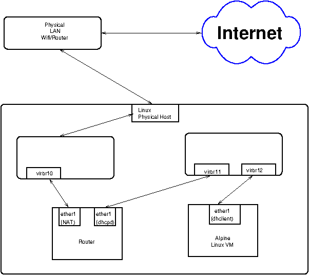

# This is the plan
This document describes the plan which will be followed to construct the
'office' network.

The build should be iterative.  The first pass should deploy and configure a
small collection of VMs.  The essentials of the infrastructure should exist at
the end of this pass.

The second and subsequent passes should deploy and configure additional VMs.

There are a number of major stages:
1. Establish an architecture/topology.
1. Build the networks
1. Build the storage pools and volumes
1. Deploy and configure the first VMs.  These are the VMs which are essential
to the architecture; for example a jumpbox.
1. Deploy and configure the subsequent VMs.  These are the VMs which I are
necessary to complete a useful environment.
The required packages:
- `libvirt`
- `terraform`
- `ansible`
- `alpine` cloud images
- `jenkins` (for testing)

## Testing
There will always be three deployments.  These are the 'production'
deployments, the 'testing' deployment, and the 'development' deployment.
These deployments will correspond to similarly named git branches.  I will
work and carry out simple tests on the `dev`' branch.  Once I'm satisfied with
this revision, I will `git merge` the `dev` branch onto the `test` branch.
A deployment based on the `test` branch will be fully tested.  Once it passes
all tests, then the `test` branch will be merged with the production (i.e.,
'master') branch.

I will use `jenkins` to carry out the testing.  The `jenkins` controller will
monitor the `GitHub` repository.  When a change occurs, the appropriate
`jenkins` worker will be dispatched to deploy VMs on the 'plane' which
corresponds to the branch which was updated.  Note that only the `testing` and
`production` deployments need to be automated.  The `dev` deployment should be
managed manually.

The fact that I plan to use `jenkins` implies that a controller and a number
of workers must exist.  I will probably automate the construction of these
VMs, but they will be based on `TurnKey` ISOs.

## The architecture
- Define DNS zones
  - home.
  - office.home.
  - control.office.home.
  - internal.office.home.
  - test.home.
  - control.test.home.
  - internal.test.home.
  - dev.home.
  - control.dev.home.
  - internal.dev.home.

|zone|IP|
|---|---|
|office.home.            |172.16.16.0/20|
|control.office.home.    |172.16.17.0/24|
|internal.office.home.   |172.16.18.0/24|
|test.home.              |172.17.16.0/20|
|control.test.home.      |172.17.17.0/24|
|internal.test.home.     |172.17.18.0/24|
|dev.home.               |172.18.16.0/20|
|control.dev.home.       |172.18.17.0/24|
|internal.dev.home.      |172.18.18.0/24|

- Define sub-networks
  -  See 

- VMs with static IP addresses
  1. `jumpbox`: 172.x.17.128
  1. `vault`: 172.x.17.129
  1. `ns1`: 172.x.18.129

## Pass 1
### Build the secrets
The deployment will require cryptographic pairs and signed certificates.
These will have to constructed and stored in an `ansible-vault`.  

### Build the networks:
Use `terraform` to build the networks.  I should loop over a collection of
objects.  These objects should include the following members:
1. The network name.
1. The FQDN.
1. The IP address range. (What does this mean?).

### Build the storage pools and volumes
- The pools are:
  1. `os-isos`: Storage for the ISOs required for the deployment.
  1. `vm-templates`: Storage for the 'cloud' images.  For example the Alpine
  `QCOW2` images.
  1. `vm-images`: Storage for the backstore for VM instances.
Note that the names are subject to change.
- The volumes are **TBD**.
### Deploy the initial VMs
- `jumpbox`; the jump-box.
- `vault`; the HashiCorp vault.

- `ns1`; the DNS server.
### Configure the initial VMs
- `jumpbox`; the jump-box.
- `vault`; the HashiCorp vault.
   - Update the `vault` from the `ansible-vault`.
- `ns1`; the DNS server.
   - Update the `named.conf` file

## Subsequent passes
### Update the secrets
Add to the `ansible-vault` secret data base.  Subsequently add to the `vault`,
using the `ansible` updates.
### Deploy the extra VMs
The extra VMs include:
- `redmine`
- `baracuda`
- `nginx`
- `cuda`
### Configure the extra VMs
